# MongoDB Task

## Design database for Zen class programme

## Create a tables

```json
use zenclass;
db.createCollection("users");
db.createCollection("codekata");
db.createCollection("attendance");
db.createCollection("topics");
db.createCollection("tasks");
db.createCollection("company_drives");
db.createCollection("mentors");

```

## Data pushing

```json
db.users.insertMany([
{'user_id':1,'user_name':'user1','email_id':'user1@gmail.com','batch_id':59,'codekata_solved':[1,2,3,4,5,6,7,8,9,10]},
{'user_id':2,'user_name':'user2','email_id':'user2@gmail.com','batch_id':59,'codekata_solved':[5,6,7,8]},
{'user_id':3,'user_name':'user3','email_id':'user3@gmail.com','batch_id':59,'codekata_solved':[2,3,5,8]},
{'user_id':4,'user_name':'user4','email_id':'user4@gmail.com','batch_id':59,'codekata_solved':[4,5,6,7]},
{'user_id':5,'user_name':'user5','email_id':'user5@gmail.com','batch_id':59,'codekata_solved':[1,2,3,4,5]},
{'user_id':6,'user_name':'user6','email_id':'user6@gmail.com','batch_id':59,'codekata_solved':[1,2,3]},
{'user_id':7,'user_name':'user7','email_id':'user7@gmail.com','batch_id':59,'codekata_solved':[5,6,7,8,9,10]}]);
```

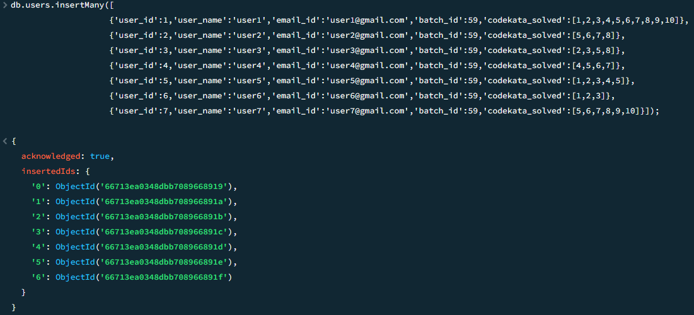

```json
db.codekata.insertMany([
                    {'question_id':1,'catagory_name':'Input/Output','description':'Write a code to get the input in the given format and print the output in the given format.'},
                    {'question_id':2,'catagory_name':'absolute beginner','description':'Write a code to get 2 integers as input and find the HCF of the 2 integer without using recursion or Euclidean algorithm.'},
                    {'question_id':3,'catagory_name':'Array','description':'You are provided with an array in which all elements are repeated thrice except one which is repeated twice.Your task is to print that number.'},
                    {'question_id':4,'catagory_name':'mathematics','description':'Given a number N, find the nearest greater multiple of 10.Input Size : N <= 10000'},
                    {'question_id':5,'catagory_name':'String','description':'You are given some words all in lower case letters your task is to print them in sorted order.'},
                    {'question_id':6,'catagory_name':'Basics','description':'Given a number N and an array of N elements, find the Bitwise OR of the array elements.'},
                    {'question_id':7,'catagory_name':'Looping','description':'Write a code to get an integer N and print the even values from 1 till N in a separate line.'},
                    {'question_id':8,'catagory_name':'Numbers','description':'A ground of a number is defined as the number which is just smaller or equal to the number given to you.Hence he started solving some assignments related to it. He got struck in some questions. Your task is to help him.'},
                    {'question_id':9,'catagory_name':'Sorting','description':'You are given a number ‘n’. Your task is to create the smallest number possible using the digits of number. The number should be of the same length as the orignal input number.'},
                    {'question_id':10,'catagory_name':'Pattern','description':'Write a code to generate a aplhabet half pyramid pattern.'}]);

```

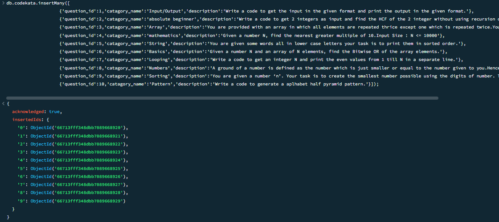

```json
db.attendance.insertMany([
                    {'session_id':1,'date':new Date('2020-10-11'),'present':[1,2,4,5],'absent':[3]},
                    {'session_id':2,'date':new Date('2020-10-12'),'present':[3,4,5],'absent':[1,2]},
                    {'session_id':3,'date':new Date('2020-10-13'),'present':[1,2,5],'absent':[3,4]},
                    {'session_id':4,'date':new Date('2020-10-14'),'present':[1,2,3,5],'absent':[4]},
                    {'session_id':5,'date':new Date('2020-10-15'),'present':[1,2,3,4],'absent':[5]},
                    {'session_id':6,'date':new Date('2020-10-16'),'present':[1,2,4],'absent':[3,5]},
                    {'session_id':7,'date':new Date('2020-10-17'),'present':[1,2,3,4],'absent':[5]},
                    {'session_id':8,'date':new Date('2020-10-18'),'present':[2,3,4,5],'absent':[1]},
                    {'session_id':9,'date':new Date('2020-10-19'),'present':[1,2,4,5],'absent':[3]},
                    {'session_id':10,'date':new Date('2020-10-20'),'present':[1,2,4,5],'absent':[3]}]);
```

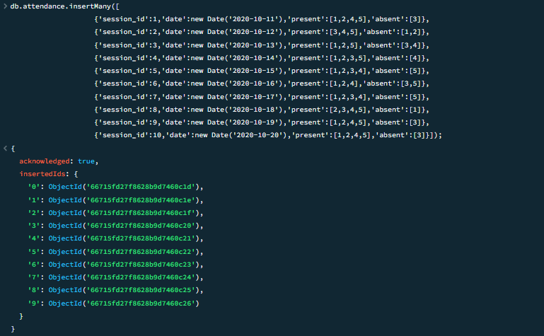

```json
  db.topics.insertMany([
                    {'id':1,'name':'HTML','description' : 'description HTML','date':new Date('2020-10-15')},
                    {'topic_id':2,'name':'CSS','description' : 'description CSS','date':new Date('2020-10-16')},
                    {'topic_id':3,'name':'Javascript','description' : 'description Javascript','date':new Date('2020-10-17')},
                    {'topic_id':4,'name':'ReactJS','description' : 'description ReactJS','date':new Date('2020-10-18')},
                    {'topic_id':5,'name':'nodeJS','description' : 'description nodeJS','date':new Date('2020-10-19')},
                    {'topic_id':6,'name':'Java','description' : 'description java','date':new Date('2020-10-20')},
                    {'topic_id':7,'name':'python','description' : 'description python','date':new Date('2020-10-21')},
                    {'topic_id':8,'name':'MYSQL','description' : 'description MYSQL','date':new Date('2020-10-22')},
                    {'topic_id':9,'name':'MongoDB','description' : 'description MongoDB','date':new Date('2020-10-23')},
                    {'topic_id':10,'name':'spring_boot','description' : 'description spring_boot','date':new Date('2020-10-24')}]);

```

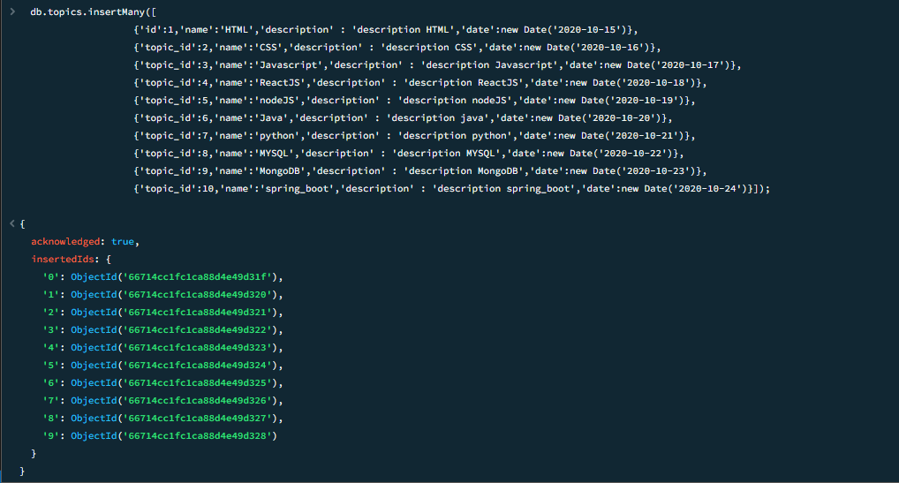

```json
db.tasks.insertMany([
                    {'task_id':1,'name':'HTML','description':'to design forms','date':new Date('2020-10-16'),'submitted':[1,3,4,5],'not_submitted':[2]},
                    {'task_id':2,'name':'CSS','description':'to design page resposiveness','date':new Date('2020-10-17'),'submitted':[1,3,5],'not_submitted':[2,4]},
                    {'task_id':3,'name':'Javascript','description':'to fetch the data from rest api','date':new Date('2020-10-18'),'submitted':[3,4,5],'not_submitted':[1,2]},
                    {'task_id':4,'name':'reactJS','description':'using router in ecommes web sites','date':new Date('2020-10-19'),'submitted':[1,2,3,4],'not_submitted':[5]},
                    {'task_id':5,'name':'java','description':'libery management sysyem','date':new Date('2020-10-20'),'submitted':[1,4,5],'not_submitted':[2,3]},
                    {'task_id':6,'name':'SQL','description':'write a joind query','date':new Date('2020-10-21'),'submitted':[1,2,3],'not_submitted':[4,5]},
                    {'task_id':7,'name':'MongoDb','description':'to create collections','date':new Date('2020-10-22'),'submitted':[1,3,4,5],'not_submitted':[2]},
                    {'task_id':8,'name':'python','description':'crud operation','date':new Date('2020-10-23'),'submitted':[1,5],'not_submitted':[2,3,4]},
                    {'task_id':9,'name':'sprig boot','description':'to connect DBMS','date':new Date('2020-10-24'),'submitted':[1,3,4,5],'not_submitted':[2]},
                    {'task_id':10,'name':'php','description':'to write a code on php','date':new Date('2020-10-25'),'submitted':[1,3,4,5],'not_submitted':[2]}]);

```

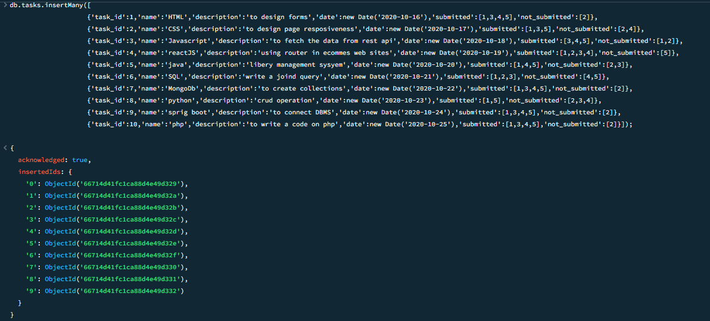

```json
  db.company_drives.insertMany([
                    {'company_id':1,'company_name':'company1','date':new Date('2020-10-07'),'student_id':[1,2,3,4,5,6,7,8,9,10,11,12,13,14,15]},
                    {'company_id':2,'company_name':'company2','date':new Date('2020-10-10'),'student_id':[9,10,11,12,13,14,15]},
                    {'company_id':3,'company_name':'company3','date':new Date('2020-10-14'),'student_id':[1,2,3,4,5,6,7,8,9,10]},
                    {'company_id':4,'company_name':'company4','date':new Date('2020-10-17'),'student_id':[1,2,9,10,11,12,13,14,15]},
                    {'company_id':5,'company_name':'company5','date':new Date('2020-10-19'),'student_id':[1,2,3,4]},
                    {'company_id':6,'company_name':'company6','date':new Date('2020-10-20'),'student_id':[6,7,8,9,10,11,12,13,14,15]},
                    {'company_id':7,'company_name':'company7','date':new Date('2020-10-24'),'student_id':[9,10,11,12,13,14,15]},
                    {'company_id':8,'company_name':'company8','date':new Date('2020-10-27'),'student_id':[7,8,9,10,11,12,13,14,15]},
                    {'company_id':9,'company_name':'company9','date':new Date('2020-10-12'),'student_id':[4,5,6,7,8,9,10,11,12,13,14,15]},
                    {'company_id':10,'company_name':'company10','date':new Date('2020-10-09'),'student_id':[1,2,3,4,5]}]);


```

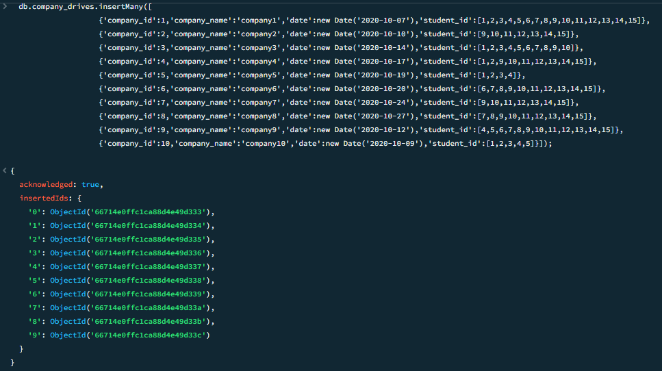

```json
db.mentors.insertMany([
                    {'mentor_id':1,'menror_name':'mentor1','email':'mentor1@gmail.com','student_id':[1,2,3,4,5,6,7,8,9,10]},
                    {'mentor_id':2,'menror_name':'mentor2','email':'mentor2@gmail.com','student_id':[11,12,13,14,15,16,17,18,19,20,21,22,23,24,25,26]},
                    {'mentor_id':3,'menror_name':'mentor3','email':'mentor3@gmail.com','student_id':[27,28,29,30,31,32,33,34,35]},
                    {'mentor_id':4,'menror_name':'mentor4','email':'mentor4@gmail.com','student_id':[36,37,38,39,40,41,42,43,44,45,46,47,48,49,50,51,52,53,54,55]},
                    {'mentor_id':5,'menror_name':'mentor5','email':'mentor5@gmail.com','student_id':[56,57,58,59,60,61,62,63,64,65,66]},
                    {'mentor_id':6,'menror_name':'mentor6','email':'mentor6@gmail.com','student_id':[67,68,69,70,71,72,73,74,75,76]},
                    {'mentor_id':7,'menror_name':'mentor7','email':'mentor7@gmail.com','student_id':[77,78,79,80,81,82,83,84,85,86,87,88,89,90,]},
                    {'mentor_id':8,'menror_name':'mentor8','email':'mentor8@gmail.com','student_id':[91,92,93,94,95,96,97,98,99,100]},
                    {'mentor_id':9,'menror_name':'mentor9','email':'mentor9@gmail.com','student_id':[101, 102, 103, 104, 105, 106, 107, 108, 109, 110, 111, 112, 113, 114, 115, 116, 117, 118]},
                    {'mentor_id':10,'menror_name':'mentor10','email':'mentor10@gmail.com','student_id':[ 119, 120, 121, 122 , 123 , 124 , 125, 126 , 127, 128, 129,130]}]);

```

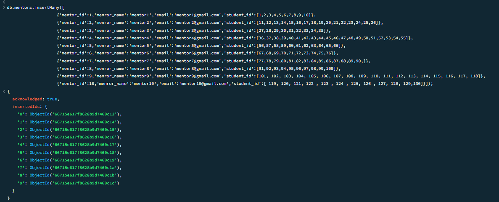


## Queries

## 1.Find all the topics and tasks which are thought in the month of October

```json
db.tasks.find({'date':{$gte:ISODate('2020-10-01'),$lt:ISODate('2020-10-31')}});
```

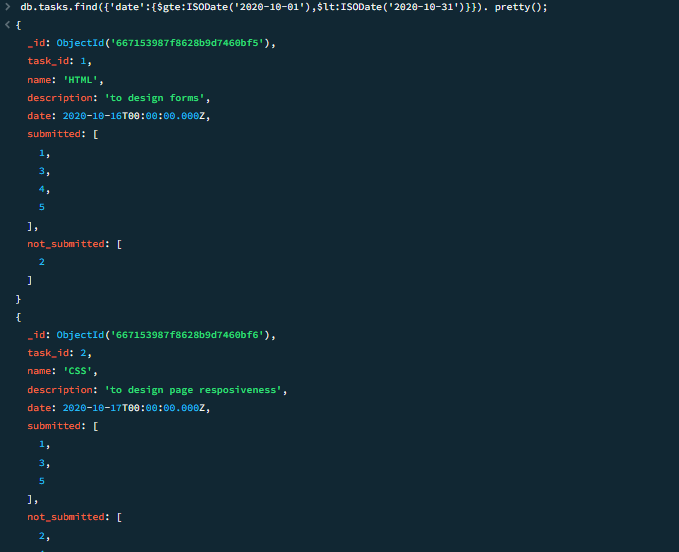
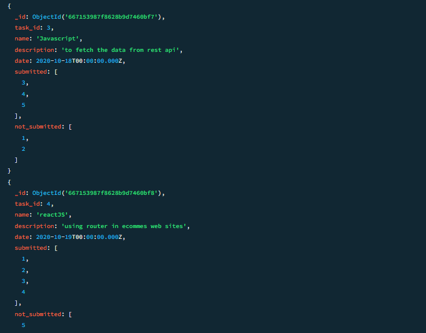
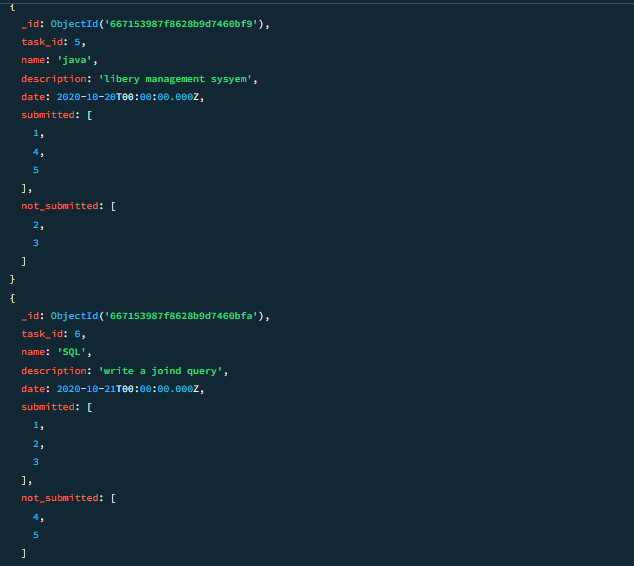
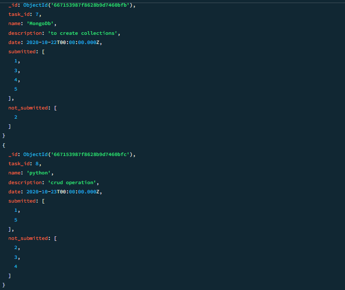
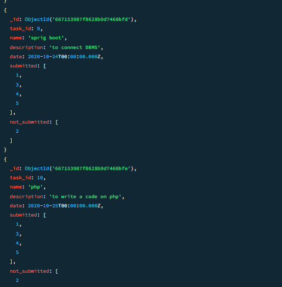

```json
db.topics.find({'date':{$gte:ISODate('2020-10-01'),$lt:ISODate('2020-10-31')}});
```

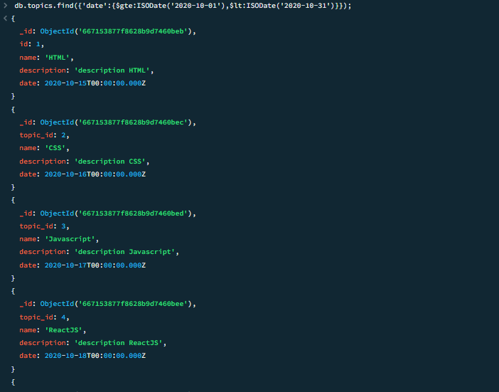
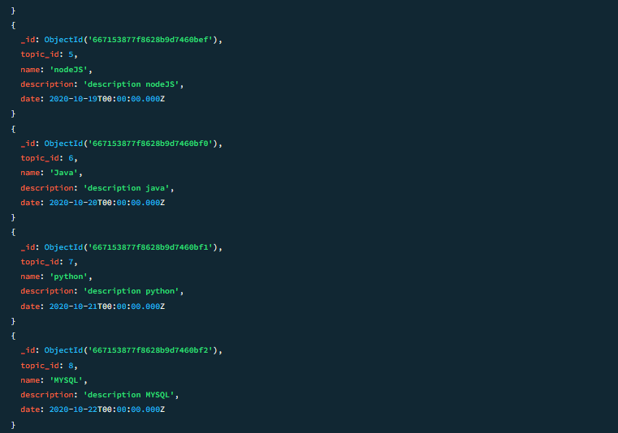
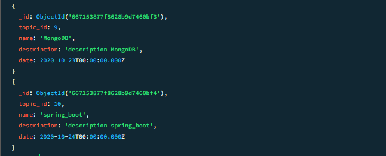

## 2.Find all the company drives which appeared between 15 oct-2020 and 31-oct-2020

```json
db.company_drives.find({'date':{$gte:ISODate('2020-10-15'),$lt:ISODate('2020-10-31')}});
```

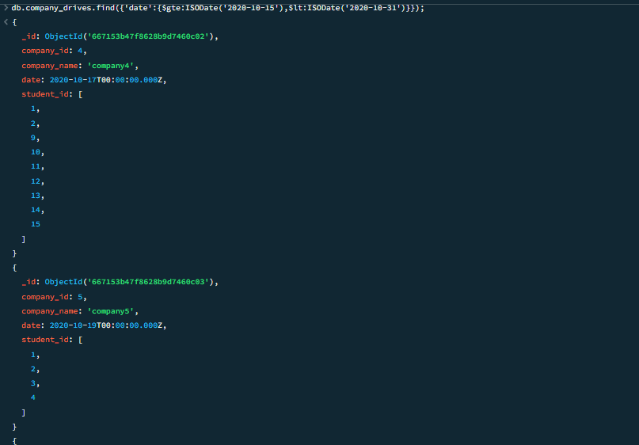
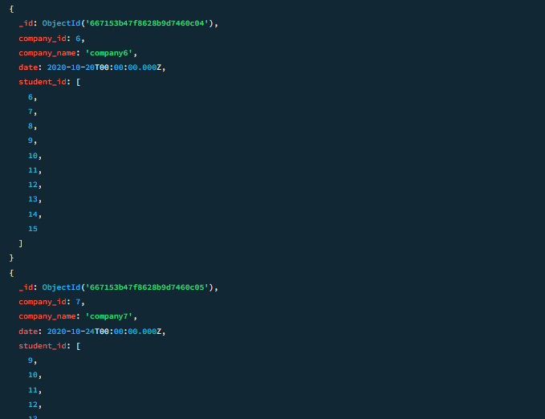
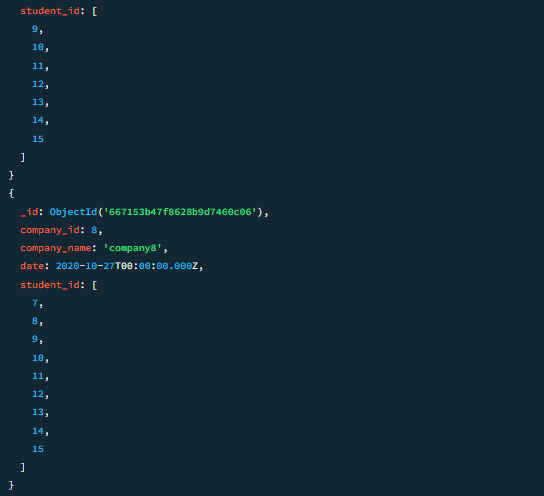

## 3.Find all the company drives and students who are appeared for the placement.

```json
db.company_drives.find({},{'_id':0,'company_name':1,'student_id':1});
```

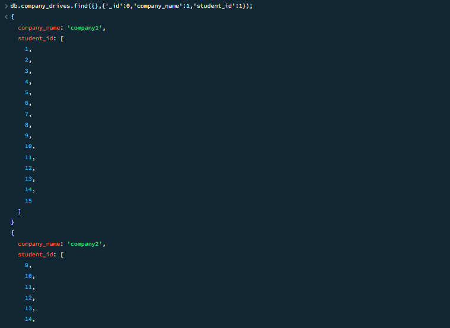
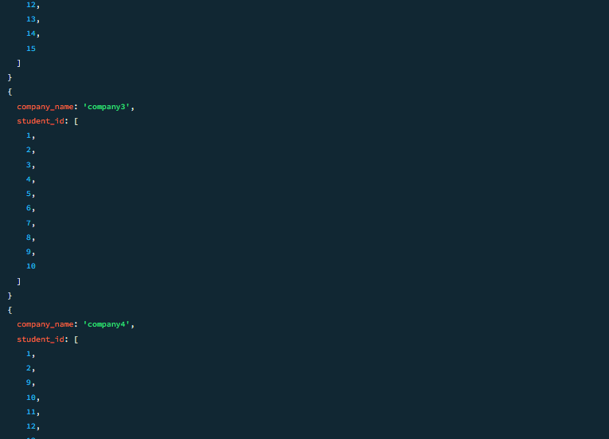
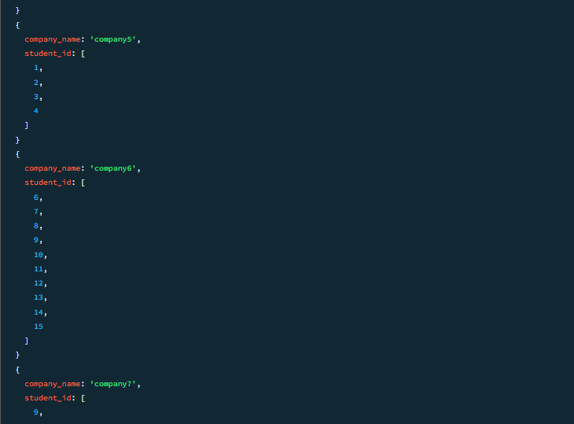
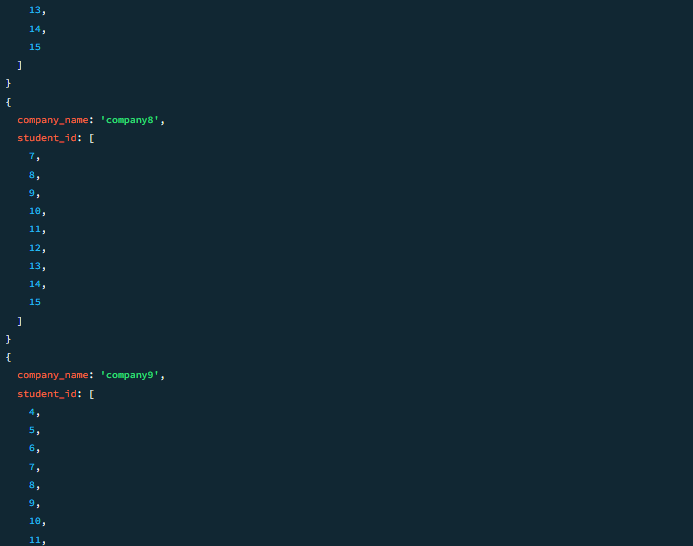
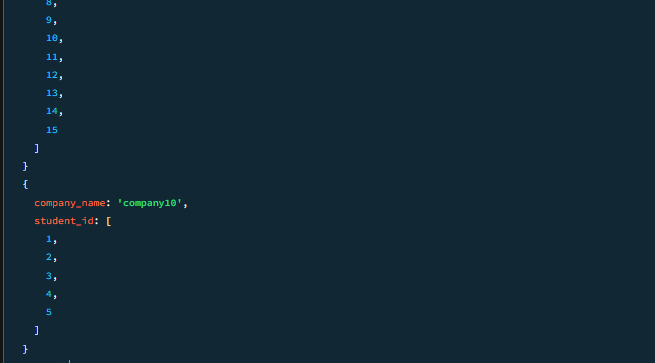

## 4.Find the number of problems solved by the user in codekata

```json
db.users.aggregate({$project:{'_id':0,'user_name':1,'no_of_prob_solved':{$size:'$codekata_solved'}}});
```

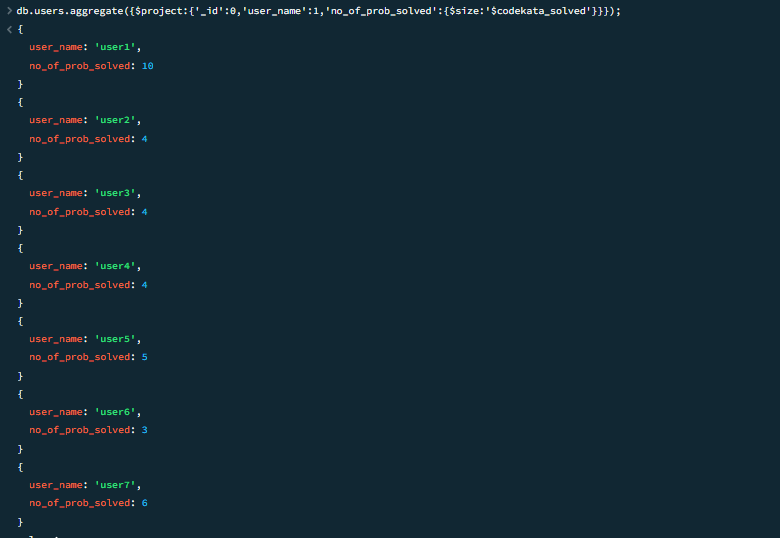

## 5.Find all the mentors with who has the mentee's count more than 15

```json
db.mentors.find({$where:'this.student_id.length > 15'},{'_id':0,'menror_name':1});
```

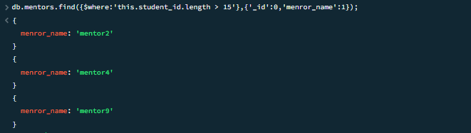

## 6.Find the number of users who are absent and task is not submitted between 15 oct-2020 and 31-oct-2020

```json
db.attendance.aggregate({$match:{'date':{$gte:ISODate('2020-10-15'),$lt:ISODate('2020-10-31')}}},{$project:{_id:0,date:1,no_of_absent:{$size:'$absent'}}});
```

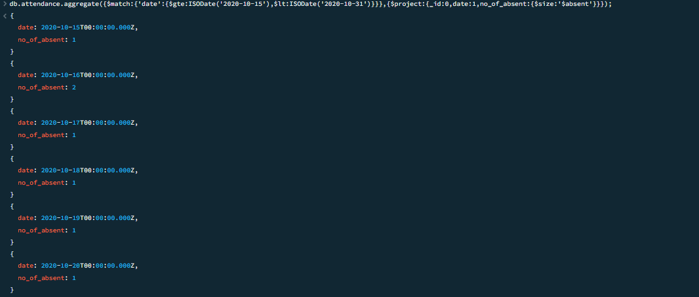

```json
 db.tasks.aggregate({$match:{'date':{$gte:ISODate('2020-10-15'),$lt:ISODate('2020-10-31')}}},{$project:{_id:0,name:1,date:1,no_of_not_submitted:{$size:'$not_submitted'}}});
```

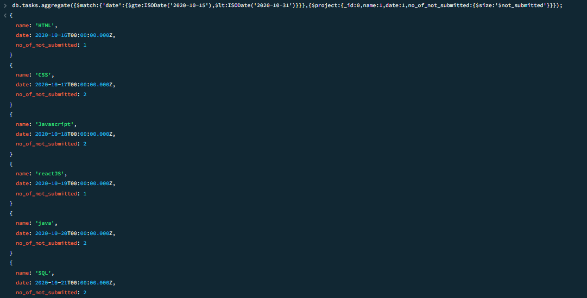
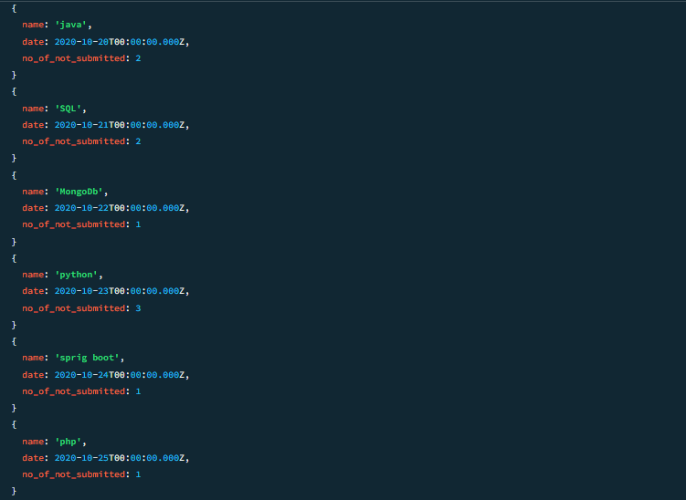
